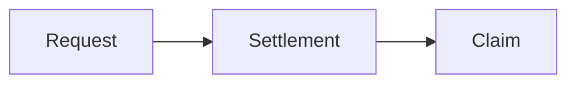

# Vaultera Documentation

Official documentation site for the Vaultera on-chain fund infrastructure protocol.

- GitHub Pages: https://vaultera-dev.github.io/vaultera-docs/
- Vercel: https://vaultera-docs.vercel.app/

## Documentation coverage

The site currently documents:

- Protocol architecture, access control, pausing, policies, and upgradeability
- Vault creation, asynchronous deposits, redemptions, escrow, and claims
- Pricing windows, quote verification, investor acceptance, and settlement
- Protocol and vault fee modules
- Execution, rebalancing, and supported adapters
- Supported networks, assets, and deployed contract addresses
- Admin and investor portals
- Security controls and protocol invariants

## Technology

- [VitePress](https://vitepress.dev/) for the documentation site
- [Mermaid](https://mermaid.js.org/) for architecture and sequence diagrams
- GitHub Actions for GitHub Pages deployment
- Vercel for root-domain deployment and previews
- Node.js 20 and npm for development and builds

## Repository structure

```text
vaultera-docs/
├── .github/workflows/
│   └── deploy-pages.yml
├── docs/
│   ├── .vitepress/
│   │   ├── config.ts
│   │   ├── config/
│   │   └── theme/
│   ├── fees/
│   ├── get-started/
│   ├── networks/
│   ├── portals/
│   ├── protocol/
│   ├── security/
│   ├── settlement/
│   ├── vaults/
│   └── index.md
├── package.json
├── package-lock.json
└── vercel.json
```

## Requirements

- Node.js 20 or newer
- npm

## Local development

Install the locked dependencies:

```bash
npm ci
```

Start the development server:

```bash
npm run docs:dev
```

VitePress prints the local URL when the server is ready.

## Production build

Build the site for root hosting such as Vercel:

```bash
npm run docs:build
```

Preview the generated site:

```bash
npm run docs:preview
```

The generated output is written to `docs/.vitepress/dist`.

## GitHub Pages build

GitHub Pages serves this project from the `/vaultera-docs/` repository path. Build locally with the same deployment target by running:

```bash
DEPLOY_TARGET=github npm run docs:build
```

The GitHub Actions workflow builds with this environment variable and deploys `docs/.vitepress/dist` whenever changes reach `main`. In repository settings, the Pages source must be set to **GitHub Actions**.

## Vercel deployment

`vercel.json` configures:

- Install command: `npm ci`
- Build command: `npm run docs:build`
- Output directory: `docs/.vitepress/dist`
- Framework: VitePress

Vercel builds without `DEPLOY_TARGET`, so the site uses `/` as its base path.

## Mermaid diagrams

Use a fenced `mermaid` block in any Markdown page:

````markdown

````

Mermaid rendering and Vaultera theme colors are configured in `docs/.vitepress/config.ts`.

## Adding documentation

1. Add or update a Markdown page under `docs/`.
2. Register new pages in the navigation or sidebar in `docs/.vitepress/config.ts`.
3. Use the reusable `AddressLink` component for blockchain addresses so each address remains copyable and opens the correct explorer in a new tab.
4. Run both production builds before submitting changes:

```bash
npm run docs:build
DEPLOY_TARGET=github npm run docs:build
```

Do not commit `node_modules` or generated VitePress output.

## Deployment checks

After deployment, verify:

- The home page and nested routes load directly.
- Navigation and local search work.
- Light and dark themes render correctly.
- Mermaid diagrams render.
- Blockchain addresses copy correctly and open the expected explorer.
- The sitemap is available at `/sitemap.xml` on Vercel and `/vaultera-docs/sitemap.xml` on GitHub Pages.
