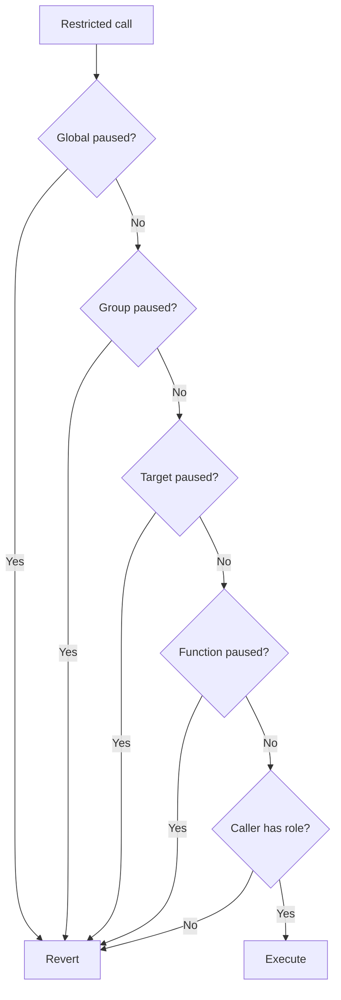

# Access Control and Pausing

`VaulteraAccessManager` is the protocol-wide authority for roles and pause state. Restricted calls evaluate pause state before checking the caller's role.

## Roles

| Role | Responsibility |
|---|---|
| `OWNER_ROLE` | Authorizes UUPS upgrades. |
| `ADMIN_ROLE` | Configures protocol fees, policies, signers, and pricing safeguards. |
| `VAULT_CREATOR_ROLE` | Creates vaults through `VaultFactory`. |
| `RELAYER_ROLE` | Submits approved relayed transactions. |
| `GUARDIAN_ROLE` | Performs security and emergency actions. |
| `COMPLIANCE_ADMIN_ROLE` | Administers compliance lists. |
| `KEEPER_ROLE` | Runs authorized settlement and rebalancing automation. |
| `PAUSER_ROLE` | Pauses and unpauses protocol operations. |

Each vault also has a manager address for vault-scoped policy, fee, and rebalancing operations.

## Pause hierarchy

The four layers are global, contract group, target contract, and target function. Pausing a vault manager blocks its deposits, redemptions, settlements, claims, and rebalancing operations.
