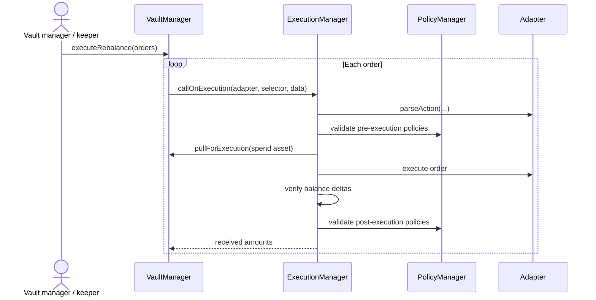

# Execution and Rebalancing

Vaultera keeps strategy execution outside the vault core. A vault manager or keeper submits a batch of orders to `VaultManager`, which routes each order through the shared `ExecutionManager`.

## Rebalancing flow

## Execution checks

For every order, `ExecutionManager`:

1. Parses the adapter action to identify spend and incoming assets.
2. Rejects duplicate asset entries.
3. Validates pre-execution policies.
4. Snapshots vault balances and pulls the approved spend amount.
5. Calls the selected adapter.
6. Verifies incoming and spent balance deltas against expected amounts.
7. Validates post-execution policies.
8. Returns the received amounts to the vault flow.

## Adapter authorization

Both protocol-level and vault-level allowed-adapter policies can restrict execution. See [Supported Adapters](/networks/supported-adapters) for the current Sepolia deployments.
