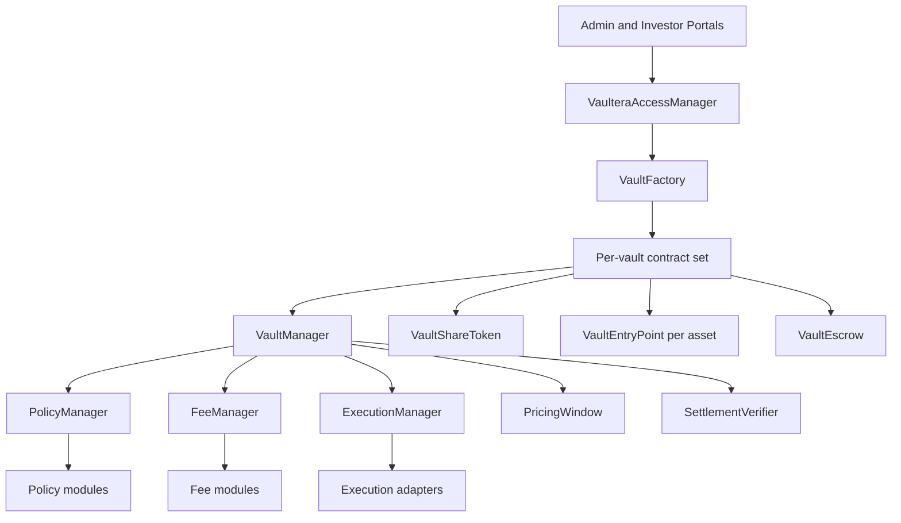

# Protocol Architecture

Vaultera is modular on-chain fund infrastructure built around a per-vault `VaultManager`. It separates vault custody and accounting from protocol-wide access, pricing, policy, fee, and execution services.

## Architecture

## Per-vault contracts

| Contract | Responsibility |
|---|---|
| `VaultManager` | Orchestrates requests, settlement, accounting, claims, and rebalancing. |
| `VaultShareToken` | ERC-20 ownership share with ERC-7575, ERC-1404, and ERC-165 behavior. |
| `VaultEntryPoint` | Provides ERC-7540 asynchronous deposit and redemption access for one asset. |
| `VaultEscrow` | Holds pending and claimable assets and shares. |

## Protocol services

| Service | Responsibility |
|---|---|
| `VaulteraAccessManager` | Roles and four-layer pause authority. |
| `VaultFactory` | Deploys and connects each per-vault contract set. |
| `PolicyManager` | Applies protocol and vault compliance and risk policies. |
| `FeeManager` | Registers fee modules and invokes lifecycle hooks. |
| `ExecutionManager` | Routes rebalancing through policy-approved adapters. |
| `PricingWindow` | Controls window timing, signer authorization, price checks, and replay protection. |
| `SettlementVerifier` | Verifies EIP-712 quote and acceptance signatures. |

## Core interaction model

1. A vault creator deploys a vault through `VaultFactory`.
2. Investors submit asynchronous deposit or redemption requests through an asset entry point.
3. Assets or shares remain in escrow while the request is pending.
4. An authorized operator signs a pricing-window quote.
5. Each participating investor signs an acceptance for that quote.
6. Settlement verifies both signatures, applies policies and fees, and mints or burns shares.
7. Vault managers and keepers rebalance through approved execution adapters.

## Standards

| Standard | Use |
|---|---|
| ERC-20 | Fungible vault shares |
| ERC-7540 | Asynchronous request, settlement, and claim lifecycle |
| ERC-7575 | Multi-asset vault share semantics |
| ERC-1404 | Share-transfer restrictions |
| ERC-165 | Interface detection |
| ERC-7201 | Namespaced upgradeable storage |
| EIP-712 | Typed quote and acceptance signatures |

## Explore the architecture

- [Access Control and Pausing](/protocol/access-control)
- [Policies and Compliance](/protocol/policies)
- [Execution and Rebalancing](/protocol/execution)
- [Upgradeability](/protocol/upgradeability)
- [Vault Lifecycle](/vaults/)
- [Pricing and Settlement](/settlement/)
