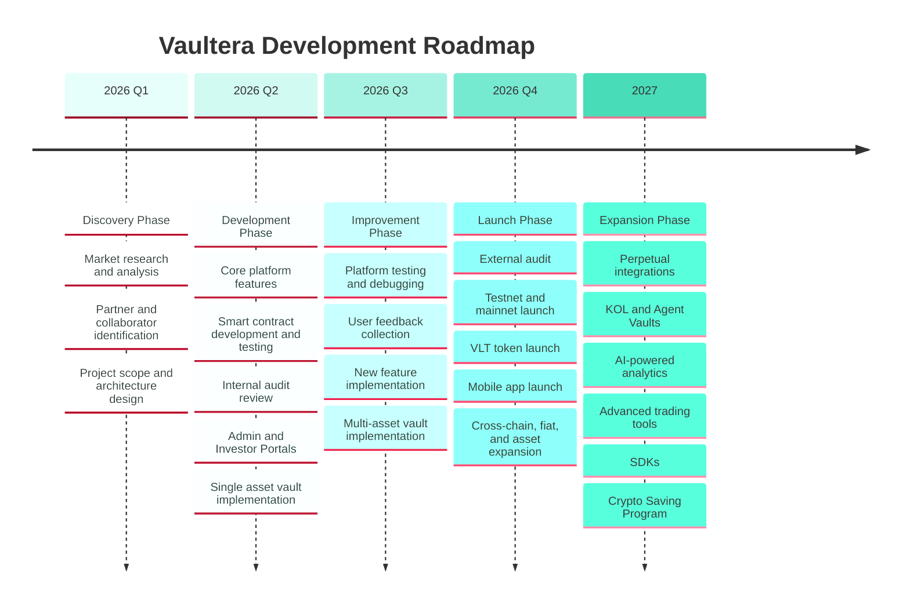

# Roadmap

This page outlines Vaultera's phased development plan, from initial discovery through post-launch expansion. Each phase groups major milestones and deliverables by target timeframe.

## At a glance

## Discovery Phase — Q1 2026

The foundation phase focuses on understanding the market and defining the product.

- Research and analysis of the market
- Identify potential partners and collaborators
- Define the scope of the project
- Create a project plan and timeline
- Architecture design

## Development Phase — Q2 2026

The build phase delivers the core protocol, smart contracts, and first portal experiences.

- Build the core features of the platform
- Integrate with existing systems
- Test and debug the platform
- Smart-contract development and testing
- Internal Audit Review
- Admin and Investor Portals
- Single Asset Vault Implementation

## Improvement Phase — Q3 2026

The refinement phase incorporates feedback and broadens vault capabilities.

- Test and debug the platform
- Gather feedback from users
- Identify areas for improvement
- Implement new features
- Multi-Asset Vault Implementation

## Launch Phase — Q4 2026

The public launch phase prepares the protocol for mainnet and introduces the VLT token and mobile experience.

- External Audit
- Launch the platform to testnet/mainnet
- Market the platform
- Launch VLT Tokens
- Mobile app launch
- New Features Implementation:
  - Cross-chain support
  - Fiat integration
  - More supported cryptocurrencies
  - More chains supported

## Expansion Phase — 2027

The post-launch phase scales the ecosystem with advanced products, integrations, and developer tooling.

- Perpetual integrations
- KOL/Agent Vaults
- AI-powered analytics
- Advanced trading tools
- SDKs
- Crypto Saving Program

---

Dates and priorities are subject to change as the project evolves. Have a feature request or want to contribute? See the [Contributing](/contributing/) page.
