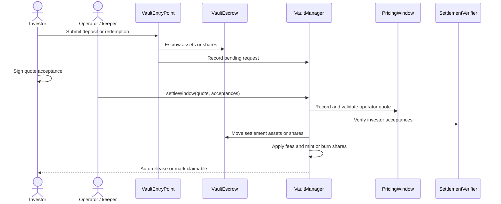

# Pricing and Settlement

Vaultera batches asynchronous deposit and redemption requests into pricing windows. NAV is supplied by an authorized signer and verified on-chain rather than calculated by the vault contracts.

## Pricing window

For each vault, `PricingWindow` stores window duration and offset, maximum settlement delay, minimum price, deviation threshold, EMA reference price, and the last recorded window. Protocol-wide state controls authorized signers and replay protection.

## Dual signatures

Settlement requires:

1. A `WindowQuote` signed by an authorized operator.
2. An `Acceptance` signed by each investor whose request is processed.

The quote binds the vault, window, NAV per share, asset prices, deadline, total assets, replay salt, and user-signature hash. Each acceptance binds the investor's request amount, kind, vault, entry point, escrow time, price, window, and deadline.

## Settlement sequence

## Signature support

`SettlementVerifier` validates EIP-712 signatures for externally owned accounts and compatible smart-contract wallets through ECDSA, EIP-1271, and ERC-6492 verification.

## Circuit breakers

A settlement is accepted only when:

- The pricing window has closed.
- Settlement occurs before the maximum delay expires.
- NAV per share and total assets are non-zero.
- NAV remains above the configured minimum.
- Price deviation remains within the EMA-based threshold.
- The quote salt has not been used.
- Repeated batches for the same vault and window use the same NAV and total assets.

## Settlement result

Accepted deposits move assets from escrow into the vault and mint shares. Accepted redemptions burn escrowed shares and allocate assets. Fee hooks run at their configured lifecycle points, and the resulting assets or shares are released automatically or recorded as claimable.
