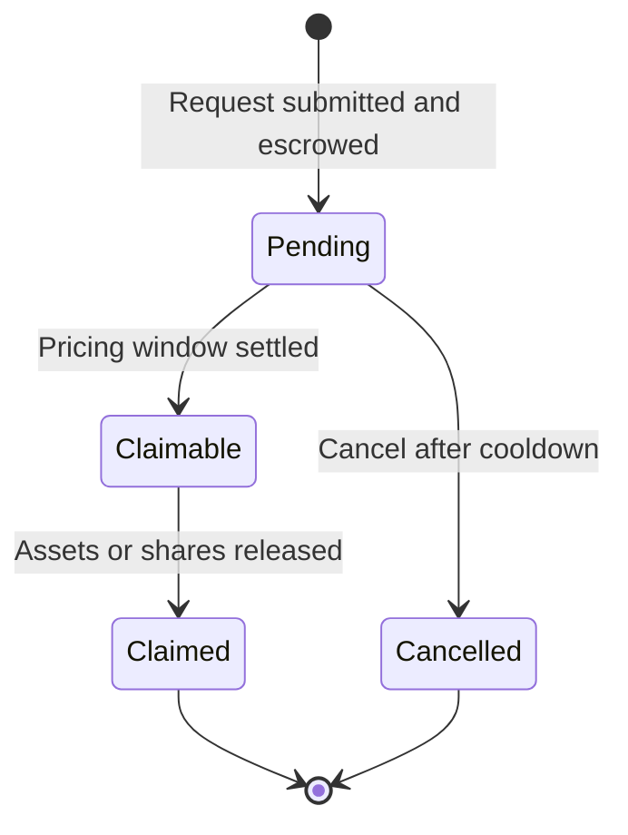

# Vault Lifecycle

Each Vaultera vault is a connected contract set deployed by `VaultFactory` and coordinated by its `VaultManager`.

## Creation

An account with `VAULT_CREATOR_ROLE` submits a configuration containing the share name and symbol, denomination asset, unique supported assets, manager, dual-signature settlement mode, category, and metadata URI.

The factory:

1. Validates the configuration and supported asset list.
2. Deploys the vault manager and marks it as authorized.
3. Deploys the share token and escrow.
4. Validates initial assets through the tracked-assets policy hook.
5. Deploys one entry point for each supported asset.
6. Connects the fee, policy, execution, pricing, and settlement services.
7. Emits the vault creation event.

## Operating states

- **Active:** requests, settlements, claims, and rebalancing operate normally.
- **Paused:** restricted operations revert at the applicable pause layer.
- **Entry point disabled:** one asset entry point rejects new requests while existing requests remain resolvable.

## Request state machine

Deposit and redemption requests maintain independent state for each controller.

## Deposit flow

1. The investor approves and calls the entry point for a supported asset.
2. The entry point transfers assets to `VaultEscrow`.
3. `VaultManager` records the pending deposit.
4. The investor accepts a signed pricing-window quote.
5. Settlement transfers the assets into the vault and calculates shares.
6. The share tokens are auto-released or become claimable.

## Redemption flow

1. The investor submits share tokens through an entry point.
2. The shares remain in escrow while redemption is pending.
3. The investor accepts a signed pricing-window quote.
4. Settlement burns the escrowed shares and calculates assets owed.
5. Assets are auto-released or become claimable.

## Cancellation and escrow

Pending requests can be cancelled after the vault's configured cancellation cooldown. The cooldown cannot exceed 30 days. Only the vault manager can instruct escrow to release assets or shares, while request accounting remains in `VaultManager`.
